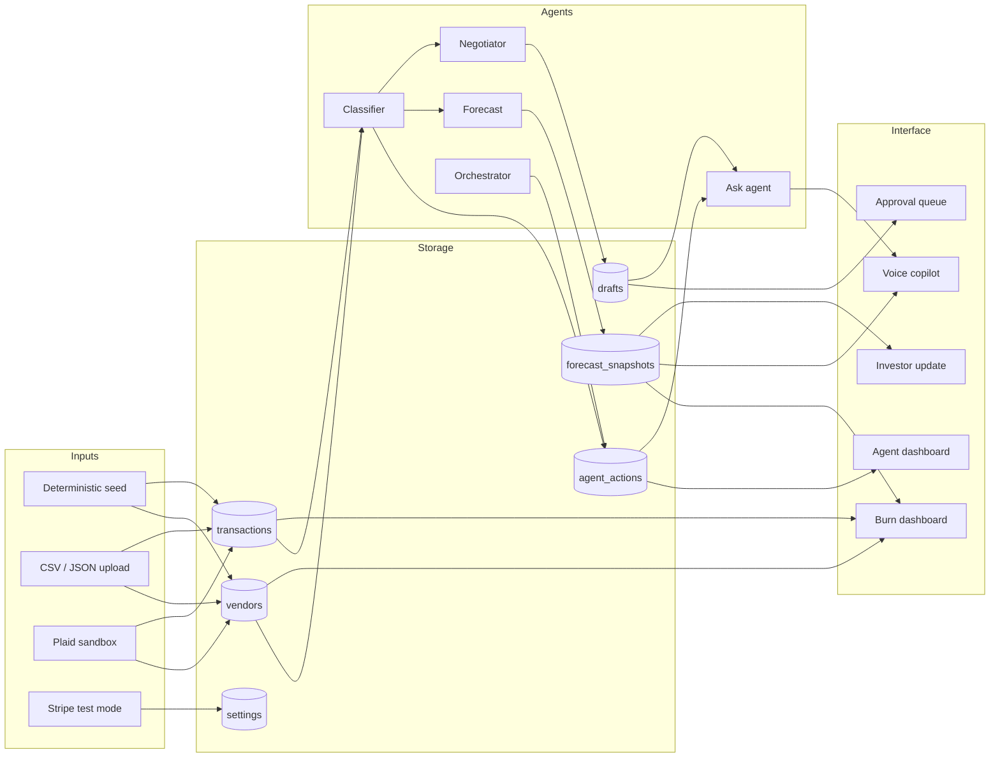

# Burn Shield

**An agentic cash-burn auditor and vendor negotiation copilot for early-stage startups.**

Burn Shield continuously examines vendor spend, identifies waste and anomalous billing, explains why each charge was flagged, estimates the financial impact, drafts the next action, and stops for human approval when a decision crosses a configurable threshold.

The project is designed around a simple observation: startups rarely fail because of one spectacular purchase. They lose time through quiet, recurring leakage from unused seats, duplicate tools, unchecked price increases, oversized plans, and billing spikes. Traditional dashboards report what happened. Burn Shield is built to investigate what happened, recommend what to do next, and carry the workflow to the point where a human decision is required.

## Table of contents

- [Purpose](#purpose)
- [What the product does](#what-the-product-does)
- [Why this is agentic](#why-this-is-agentic)
- [Product experience](#product-experience)
- [System architecture](#system-architecture)
- [Agent workflow](#agent-workflow)
- [Detection and explainability](#detection-and-explainability)
- [Forecasting](#forecasting)
- [Human approval and negotiation](#human-approval-and-negotiation)
- [Bring your own data](#bring-your-own-data)
- [Plaid and Stripe integrations](#plaid-and-stripe-integrations)
- [Voice copilot and Q&A](#voice-copilot-and-qa)
- [Investor update](#investor-update)
- [Safety model](#safety-model)
- [Technology stack](#technology-stack)
- [Local setup](#local-setup)
- [Configuration](#configuration)
- [Scripts and verification](#scripts-and-verification)
- [API reference](#api-reference)
- [Data model](#data-model)
- [Project structure](#project-structure)
- [Deployment](#deployment)
- [Hackathon demo flow](#hackathon-demo-flow)
- [Current limitations](#current-limitations)

## Purpose

Burn Shield exists to help founders answer five questions before cash leakage becomes a crisis:

1. **What changed?** Which vendors, invoices, subscriptions, or usage patterns moved outside normal behavior?
2. **Why was it flagged?** Which measurable signals contributed to the finding?
3. **What is it worth?** How much can reasonably be recovered each month and each year?
4. **What happens to the company if we act?** How does each decision affect burn and months of cash?
5. **What needs a human?** Which drafts or negotiated outcomes cross the autonomy threshold?

The goal is not to automate finance teams out of the loop. It is to automate monitoring, calculation, evidence gathering, and first-draft work so that humans spend their attention on high-impact judgment calls.

## What the product does

Burn Shield combines a responsive overview dashboard with an interactive agent workspace.

### Overview and burn dashboard

- Current monthly burn and vendor spend
- Monthly revenue offset
- Months of cash under multiple scenarios
- Savings identified by the audit
- Spend by vendor and category
- Historical burn and vendor-spend charts
- Recent transactions and bank balances
- Workflow status, alerts, findings, and agent actions
- Voice copilot on the main dashboard for quick questions and commands
- Mobile-friendly layouts, charts, tables, controls, and navigation

### Agent dashboard

- Upload CSV or JSON spend data
- Run the complete audit as a streamed workflow
- Inspect findings and exact score contributions
- Review forecast scenarios and Monte Carlo bands
- Review generated drafts and approval gates
- Continue multi-round vendor negotiations
- Generate an investor-ready summary

### Immediate dataset synchronization

Uploading a file replaces the active spend dataset and refreshes both dashboard views without reloading the browser tab. Vendor totals, burn, charts, scenarios, findings, approvals, transactions, and status text are all derived from the newly imported state. Repeated imports clear stale findings and drafts before the next audit.

## Why this is agentic

Burn Shield is not a static dashboard with an AI text box attached. It is a coordinated workflow with persistent state, explicit tools, streamed reasoning, and human decision boundaries.

The system:

1. Reads current transaction and vendor data.
2. Runs deterministic anomaly detectors.
3. Writes findings and explanations to the database.
4. Computes savings and financial scenarios.
5. Resolves a billing contact.
6. Drafts a cancellation or renegotiation message.
7. Compares the estimated impact with policy.
8. Holds high-impact actions for approval.
9. Records every action and reason.
10. Supports additional negotiation rounds and human accept/walk decisions.

The language model can improve prose, but it does not decide whether a transaction is anomalous and it does not calculate financial totals. Those decisions remain deterministic, testable, and explainable.

## Product experience

A typical session looks like this:

1. Open `/` and review the current Burn Dashboard.
2. Select **Try Burn Shield** or switch to **Agent dashboard**.
3. Use the deterministic demo seed, connect a Plaid sandbox account, or upload CSV/JSON spend.
4. Press **Run audit**.
5. Watch agent actions stream into the console.
6. Expand a finding to inspect its feature contributions.
7. Compare Current, Aggressive cut, and Hiring freeze scenarios.
8. Review drafted vendor messages.
9. Approve, reject, accept, or walk away from gated decisions.
10. Use the voice copilot, or type a question, to request a grounded summary.
11. Open the generated investor update and export it to PDF.

## System architecture

Burn Shield is a single Next.js application. API routes contain the server-side workflow; the UI consumes normal JSON state and Server-Sent Events.



Detailed implementation notes are available in [`docs/ARCHITECTURE.md`](docs/ARCHITECTURE.md).

## Agent workflow

### 1. Classifier

The Classifier evaluates the latest billing period and historical vendor behavior. It produces structured findings containing:

- Finding kind
- Vendor and transaction
- Confidence
- Headline explanation
- Monthly cost
- Feature values
- Signed feature contributions

### 2. Forecast

The Forecast agent calculates:

- Current monthly burn
- Net burn after revenue
- Vendor-spend share
- Current months of cash
- Aggressive-cut scenario
- Hiring-freeze scenario
- Monthly savings
- An 18-month cash path
- A 4,000-trial Monte Carlo uncertainty band per scenario

### 3. Negotiator

For each finding, the Negotiator:

- Resolves the best available billing contact
- Chooses cancellation or renegotiation based on the finding
- Produces a deterministic template in demo mode
- Optionally uses NVIDIA NIM for grounded prose in live mode
- Records where contact information came from
- Stores the draft for review

### 4. Orchestrator

The Orchestrator coordinates the sequence, streams progress over SSE, persists actions, and enforces the approval policy. It is responsible for stopping rather than acting when impact exceeds the configured threshold.

### 5. Negotiation loop

After the initial draft, Burn Shield can simulate or process additional vendor rounds:

- Ask
- Vendor counter
- Counteroffer
- Evaluate against target and ceiling
- Accept autonomously when permitted
- Escalate when a human decision is required
- Record human accept or walk decisions

### 6. Ask agent

The Ask agent grounds answers in current vendors, findings, forecasts, drafts, approvals, and negotiation history. Common questions use a deterministic intent router; open questions can use the configured LLM with a facts-only prompt and fallback. The voice copilot on the main dashboard uses this same endpoint for spoken and typed questions.

## Detection and explainability

The Classifier currently supports five detection patterns.

| Detector | Signal |
|---|---|
| `overpriced` | Vendor cost is materially above category peers without a usage justification. |
| `duplicate` | Multiple vendors provide the same function and combined active seats exceed the company need. |
| `usage_drift` | Paid capacity is significantly above active usage. |
| `price_creep` | Cost rises materially and monotonically across billing periods without a plan change. |
| `billing_spike` | A single invoice is far above the vendor median and then returns toward normal. |

Duplicate detection uses a `functionTag`, not only category. For example, Notion and Confluence can both map to `knowledge_base`, while Linear maps to `issue_tracking` even though all three may appear under Productivity.

### Exact feature contributions

Each detector is represented as a small linear score:

```text
score = sigmoid(bias + Σ wᵢ · (xᵢ − baselineᵢ))
```

For this model, the displayed contribution for feature `i` is exactly:

```text
wᵢ · (xᵢ − baselineᵢ)
```

That means the contribution bars are the arithmetic decomposition of the score, not an LLM explanation written after the decision. Positive values push toward flagging; negative values push against it.

## Forecasting

Forecasting is deliberately implemented in code instead of delegated to a language model.

The baseline model combines:

- Vendor spend from the active dataset
- Fixed payroll and overhead assumptions
- Monthly recurring revenue
- Current cash on hand
- Savings estimated from active findings

Three deterministic scenarios are produced:

- **Current**: no remediation
- **Aggressive cut**: all identified vendor actions land
- **Hiring freeze**: identified actions land and planned hiring is paused

Each scenario also receives a seeded Monte Carlo band. The simulation varies structural burn and revenue growth assumptions so the UI communicates uncertainty rather than pretending that one point estimate is certain.

## Human approval and negotiation

`APPROVAL_THRESHOLD` defines the monthly impact above which Burn Shield must stop for a human.

For each draft:

- Under threshold: the action may be cleared by policy, but email delivery remains sandbox-only.
- Over threshold: the draft is held in the Approval Queue.
- Approval: the decision is recorded and may be released to the sandbox outbox.
- Rejection: the draft remains recorded but is not sent.
- Negotiated outcome: the agent can accept only within policy; otherwise it presents Accept/Walk controls to a human.

The threshold is a configurable policy, not a mathematical proof of safety. Production use would require organization-specific allow-lists, rate limits, first-contact approval, role-based access, audit retention, and stronger identity controls.

## Bring your own data

The **Your data** panel accepts CSV and JSON files up to 5 MB. The default behavior replaces the active spend dataset, preserves independently synced Stripe revenue, and clears old agent outputs. The next audit is therefore based only on the uploaded spend.

### CSV format

Use one row per vendor charge or vendor billing period. Multiple rows for the same vendor and month are summed.

| Field | Required | Accepted aliases | Purpose |
|---|---:|---|---|
| `vendor` | Yes | `vendor_name`, `merchant`, `payee`, `name`, `description` | Vendor identity |
| `amount` | Yes | `cost`, `total`, `spend`, `charge`, `price` | Spend amount |
| `date` | Yes | `period`, `month`, `billing_period`, `posted`, `transaction_date` | Billing month |
| `category` | No | `type`, `department` | Peer comparison |
| `seats` | No | `licenses`, `users`, `provisioned_seats` | Provisioned usage |
| `active_seats` | No | `active`, `used_seats`, `seats_used` | Actual usage |
| `function_tag` | No | `function`, `tag` | Duplicate-tool grouping |
| `contract_terms` | No | `contract`, `terms`, `billing` | Negotiation context |
| `contact_email` | No | `email`, `billing_email` | Draft destination |

Supported date examples include `2026-01-15`, `2026-01`, `01/15/2026`, and `Jan 2026`; all are bucketed to the first day of the corresponding month.

A ready-to-use fixture is available at [`public/sample-spend.csv`](public/sample-spend.csv).

### JSON formats

A bare row array is accepted:

```json
[
  {
    "vendor": "Example Cloud",
    "amount": 1200,
    "date": "2026-01-01",
    "category": "Infrastructure"
  }
]
```

A workspace export is also accepted:

```json
{
  "workspace": { "name": "Example Labs" },
  "vendors": [],
  "transactions": []
}
```

The vendor side table can enrich transactions with category, contract terms, contact email, function tag, and seat counts. Imported `agent_actions` and `forecast_snapshots` are intentionally ignored because they are outputs; Burn Shield regenerates them from raw spend.

A JSON fixture is available at [`public/sample-spend.json`](public/sample-spend.json).

### Import refresh behavior

After a successful upload:

1. The import endpoint finishes its database transaction.
2. The Agent Dashboard fetches fresh state with cache disabled.
3. The Burn Dashboard receives the same mutation notification and refreshes.
4. Previous live actions, findings, and approval drafts are cleared.
5. Charts, KPI tiles, vendor tables, category totals, transaction lists, and scenarios render from the imported data.
6. Import controls remain busy until both views finish refreshing.

No browser reload is required.

## Plaid and Stripe integrations

### Plaid sandbox

Plaid Link creates a sandbox Item. After connection, Burn Shield:

- Stores the access token locally for the demo session
- Fetches accounts and balances
- Retries transaction retrieval to account for sandbox transaction readiness
- Maps transactions into the agent tables
- Keeps the bank panel usable even if background synchronization fails

The Plaid server client is hard-coded to sandbox. This repository does not expose a production-environment switch.

### Stripe test mode

Stripe supplies test subscription revenue. Burn Shield:

- Rejects non-test secret keys
- Normalizes active subscriptions into MRR
- Stores the latest revenue profile in `settings`
- Preserves synced revenue when spend is replaced by an upload
- Uses the revenue offset in every forecast

### Synchronization modes

- `DEMO_MODE=true`: deterministic seed/import behavior; no external agent calls
- `DEMO_MODE=false`: Plaid sandbox, Stripe test mode, search, and optional LLM calls are enabled when configured

## Voice copilot and Q&A

Burn Shield includes a voice copilot on the main Burn Dashboard. You can type a question, press and hold the microphone, or click a suggestion. The copilot replies in text and can read the answer out loud.

Examples:

- Run a burn check
- What did you find?
- How many months of cash do we have?
- What is waiting for my approval?
- Approve all held drafts

The copilot uses the same grounded state as the Ask endpoint. Rule-based answers are generated directly from the current database. Open-ended questions can be sent to NVIDIA NIM, but the prompt is grounded in a generated facts blob and always has a deterministic fallback.

When `ELEVENLABS_API_KEY` is configured, speech goes through the server-side ElevenLabs proxy. The API key never reaches the browser. If the configured voice is a paid library or clone, the server falls back to a free default voice before giving up. Without an ElevenLabs key, or if the browser blocks microphone access, the copilot falls back to the browser's built-in Web Speech API.

## Investor update

`/investor-update` builds an investor-ready summary from the active audit:

- Headline and reporting period
- Burn, recoverable spend, and cash-horizon KPIs
- Findings and confidence
- Scenario comparison
- Approval governance
- Realized negotiation savings
- Narrative generated from recorded actions

The page is print-optimized; use the browser print dialog to export it as PDF.

## Safety model

Burn Shield intentionally limits real-world side effects.

### Enforced safeguards

- Mail delivery only accepts known Mailtrap sandbox hosts.
- Stripe rejects keys that do not begin with `sk_test_`.
- Plaid uses the sandbox base URL.
- Search-discovered billing contacts must match the vendor's own domain.
- High-impact actions require an explicit approval decision.
- Negotiation decisions are recorded as agent actions.
- Demo mode avoids external model and search calls.
- Imported agent outputs are discarded and regenerated.
- Every finding contains deterministic feature contributions.

### Email safety

There is no intended path from this demo to a real vendor inbox. `lib/mailer.ts` rejects non-sandbox SMTP hosts. To inspect email delivery, configure a Mailtrap sandbox.

## Technology stack

| Layer | Technology |
|---|---|
| Framework | Next.js 16 App Router |
| UI | React 19, TypeScript, Tailwind CSS 4 |
| Charts | Recharts |
| Icons | Lucide React |
| Database | SQLite through `better-sqlite3` |
| Banking | Plaid sandbox |
| Revenue | Stripe test mode |
| LLM | NVIDIA NIM with primary/backup models and deterministic fallback |
| Email | Nodemailer, restricted to Mailtrap sandbox |
| Search | Composio CLI, optional Tavily fallback |
| Streaming | Server-Sent Events from Next.js route handlers |
| Voice | ElevenLabs TTS/STT with browser Web Speech fallback |
| Deployment | Vercel-compatible Next.js build |

## Local setup

### Prerequisites

- Node.js 20 LTS or a compatible newer release
- npm
- Git
- Optional: Plaid sandbox credentials, Stripe test credentials, NVIDIA API key, Mailtrap sandbox, Composio CLI login, or Tavily key

`better-sqlite3` is a native dependency. On platforms without a prebuilt binary, installation may require Python and a C++ build toolchain. Node.js LTS is recommended for the smoothest installation.

### Install and run

```bash
git clone https://github.com/jcb1515/Ignition-Hacks.git
cd Ignition-Hacks
npm install
npm run dev
```

Open [http://localhost:3000](http://localhost:3000).

The SQLite schema is applied on first open. If the database is empty and `AUTO_SEED` is not `false`, Burn Shield automatically loads the deterministic sample dataset.

### Optional environment file

macOS/Linux:

```bash
cp .env.example .env.local
```

PowerShell:

```powershell
Copy-Item .env.example .env.local
```

No keys are required for demo mode.

## Configuration

| Variable | Default | Purpose |
|---|---|---|
| `DEMO_MODE` | `true` | Disables external agent calls and uses deterministic templates. |
| `APPROVAL_THRESHOLD` | `1000` | Monthly impact requiring human approval. |
| `DATABASE_PATH` | Local SQLite file or OS temp directory | Overrides database location. |
| `AUTO_SEED` | enabled unless `false` | Seeds an empty database automatically. |
| `AUDIT_PACE_MS` | `0` in the current demo configuration | Delay between streamed audit events. |
| `NVIDIA_API_KEY` | unset | Primary NVIDIA NIM key. |
| `NVIDIA_API_KEY_BACKUP` | primary key fallback | Backup NIM key. |
| `NVIDIA_MODEL` | `deepseek-ai/deepseek-v4-flash-0731` | Primary model. |
| `NVIDIA_MODEL_BACKUP` | `google/gemma-4-31b-it` | Backup model. |
| `LLM_TIMEOUT_MS` | `20000` | Model request timeout. |
| `PLAID_CLIENT_ID` | unset | Plaid sandbox client ID. |
| `PLAID_SECRET` | unset | Plaid sandbox secret. |
| `PLAID_INSTITUTION_ID` | sandbox default | Institution used by server-side sync. |
| `PLAID_ACCESS_TOKEN` | unset | Optional reusable Plaid Item token. |
| `STRIPE_SECRET_KEY` | unset/test placeholder | Stripe test-mode secret; live keys are rejected. |
| `SEARCH_API_KEY` | unset | Optional Tavily fallback for contact lookup. |
| `ELEVENLABS_API_KEY` | unset | Enables higher-quality TTS and STT for the voice copilot. |
| `ELEVENLABS_VOICE_ID` | unset | Preferred voice; falls back to a free default if unavailable. |
| `ELEVENLABS_TTS_MODEL` | `eleven_flash_v2_5` | Text-to-speech model. |
| `ELEVENLABS_TTS_OUTPUT_FORMAT` | `mp3_44100_128` | Audio format returned to the client. |
| `ELEVENLABS_STT_MODEL` | `scribe_v2` | Speech-to-text model. |
| `ELEVENLABS_STT_LANGUAGE` | `en` | Transcript language code. |
| `SMTP_HOST` | Mailtrap sandbox host | Sandbox SMTP host. |
| `SMTP_PORT` | `2525` | Sandbox SMTP port. |
| `SMTP_USER` / `SMTP_PASS` | unset | Mailtrap credentials. |
| `SMTP_FROM` | demo finance address | Sender shown in sandbox drafts. |

Never commit `.env.local`, `elevenlabs.env`, API keys, voice keys, access tokens, or SMTP credentials.

## Scripts and verification

| Command | Purpose |
|---|---|
| `npm run dev` | Start the development server. |
| `npm run build` | Create and type-check the production build. |
| `npm run start` | Serve the production build. |
| `npm run lint` | Run ESLint. |
| `npm run seed` | Reset the active database to deterministic demo data. |
| `npm run smoke` | Run the 61-check agent, import, forecast, approval, and safety suite. |
| `npm run smoke:int` | Exercise integration normalization, guards, Q&A, and reporting. |
| `npm run preflight` | Run the pre-demo environment and test gate. |

The smoke suite is destructive to the configured database because it reseeds repeatedly. Use a disposable `DATABASE_PATH` when testing data you want to preserve.

The import regression section specifically verifies:

1. Sample CSV replacement
2. Uploaded vendor totals
3. Clearing old findings and approvals
4. Audit repopulation
5. JSON replacement after CSV
6. Updated forecast totals and chart history
7. Clearing stale findings and approvals after a second import

Recommended pre-push verification:

```bash
npm run lint
npx tsc --noEmit
npm run smoke
npm run build
```

## API reference

### Product state and workflow

| Method | Route | Purpose |
|---|---|---|
| `GET` | `/api/state` | Return the complete dashboard state. |
| `POST` | `/api/audit` | Run the orchestrated audit and stream SSE events. |
| `POST` | `/api/reset` | Reset to deterministic seed data. |
| `POST` | `/api/import` | Replace or merge spend from CSV/JSON. |
| `POST` | `/api/approve` | Approve or reject a draft. |
| `POST` | `/api/ask` | Ask a grounded question about current state. |
| `GET` | `/api/investor-update` | Return the generated investor-update payload. |

### Negotiation

| Method | Route | Purpose |
|---|---|---|
| `GET` | `/api/negotiate?vendorId=...` | Load a vendor negotiation thread. |
| `POST` | `/api/negotiate` | Stream a negotiation session. |
| `POST` | `/api/negotiate/decide` | Record a human accept/walk decision. |

### Integrations

| Method | Route | Purpose |
|---|---|---|
| `GET` | `/api/sync` | Report configured integration status. |
| `POST` | `/api/sync` | Pull configured Plaid/Stripe sandbox data. |
| `POST` | `/api/plaid/link-token` | Create a Plaid Link token. |
| `POST` | `/api/plaid/exchange` | Exchange a Plaid public token. |
| `POST` | `/api/plaid/accounts` | Fetch linked accounts and balances. |
| `POST` | `/api/plaid/transactions` | Fetch linked transactions. |
| `POST` | `/api/nvidia/chat` | Browser-facing NVIDIA chat proxy. |

### Voice copilot

| Method | Route | Purpose |
|---|---|---|
| `GET` | `/api/voice` | Return ElevenLabs and browser-speech capability flags. |
| `POST` | `/api/tts` | Turn text into audio through the server-side ElevenLabs proxy. |
| `POST` | `/api/stt` | Transcribe a posted audio blob through ElevenLabs Scribe. |

### Pages

| Route | Purpose |
|---|---|
| `/` | Marketing overview and Burn Dashboard. |
| `/#try` | Open the home page directly in Agent Dashboard mode. |
| `/features` | Product workflow explanation. |
| `/pricing` | Pricing presentation. |
| `/investor-update` | Print-ready investor summary. |

## Data model

Burn Shield uses six SQLite tables.

| Table | Purpose |
|---|---|
| `vendors` | Vendor metadata, cost, usage, function, and workflow status. |
| `transactions` | Monthly spend, flags, confidence, reasons, and feature JSON. |
| `agent_actions` | Immutable-style action log with reasoning, impact, and approval metadata. |
| `forecast_snapshots` | Persisted scenario snapshots. |
| `drafts` | Negotiation/cancellation email artifacts and decisions. |
| `settings` | Synced facts such as Stripe revenue and imported company name. |

The action log is central to the product. It is both the audit trail shown to the user and the grounding source for summaries and Q&A.

## Project structure

```text
app/
  api/
    approve/                 human draft decisions
    ask/                     grounded Q&A
    audit/                   SSE audit stream
    import/                  CSV/JSON ingestion
    investor-update/         report payload
    negotiate/               negotiation stream and history
    nvidia/                  browser-facing NIM proxy
    plaid/                   sandbox Link/accounts/transactions
    reset/                   deterministic reseed
    state/                   complete dashboard state
    sync/                    Plaid/Stripe synchronization
  features/                  workflow page
  investor-update/           print-ready report
  pricing/                    pricing page
  page.tsx                    overview + both dashboard views
components/
  agent-dashboard.tsx        agent workspace and synchronized refresh
  approval-queue.tsx         human approval surface
  bank-panel.tsx             Plaid connection and transactions
  voice-agent.tsx            voice copilot with ElevenLabs and browser fallback
  flag-card.tsx              explainable finding
  negotiation-thread.tsx     multi-round negotiation UI
  upload-panel.tsx           CSV/JSON upload
  motion.tsx                 reusable animation primitives
lib/
  agents/
    classifier.ts            deterministic detectors and scoring
    forecast.ts              scenarios, cash paths, Monte Carlo
    negotiator.ts            contact lookup and initial draft
    negotiation.ts           multi-round policy loop
    counterparty.ts          deterministic demo vendor
    orchestrator.ts          end-to-end audit generator
  db/                        SQLite connection, schema, queries, seed
  integrations/              Plaid, Stripe, and normalization
  ask.ts                     rule router and grounded fallback
  import.ts                  CSV/JSON parsing and replacement
  investor-update.ts         report generation
  llm.ts                     NVIDIA NIM client and fallback
  mailer.ts                  Mailtrap-only delivery
scripts/
  seed.ts                    deterministic seed command
  smoke-test.ts              61-check core suite
  smoke-integrations.ts      integration and reporting checks
  preflight.ts               demo readiness gate
docs/
  ARCHITECTURE.md             deeper implementation notes
  DEMO_SCRIPT.md              presentation flow and checklist
```

## Deployment

The app builds and runs on Vercel. `next.config.ts` explicitly includes the SQLite schema in serverless output tracing.

### Important persistence note

On a serverless host, the deployed bundle is read-only. Burn Shield therefore places SQLite in the operating-system temp directory when the project directory is not writable. That database is:

- Local to one function instance
- Ephemeral
- Automatically seeded when empty
- Appropriate for a hackathon demonstration
- Not appropriate for durable multi-user production storage

A production deployment should replace local SQLite with a managed durable database and add tenant isolation, authentication, authorization, migrations, backups, and concurrency controls.

After changing environment variables in Vercel, trigger a new deployment so server functions receive the updated values.

## Hackathon demo flow

A reliable judging flow:

1. Open the Burn Dashboard and explain the current burn problem.
2. Click **Try Burn Shield**.
3. Show that the app works without credentials in deterministic demo mode.
4. Optionally upload `sample-spend.csv` to prove the workflow accepts user data.
5. Run the audit and narrate streamed actions.
6. Expand Twilio, Confluence, Segment, or Datadog to show exact evidence.
7. Compare scenario outcomes.
8. Open the approval queue and explain why the agent stopped.
9. Run or inspect a negotiation thread.
10. Ask the voice copilot a grounded question or run a command by voice.
11. Open the investor update as the closing artifact.

Before presenting:

```bash
npm run preflight
```

Also review [`docs/DEMO_SCRIPT.md`](docs/DEMO_SCRIPT.md). A recorded backup is included under `docs/` for venue or network failures.

## Current limitations

Burn Shield is a hackathon-grade prototype with intentionally explicit boundaries:

- No user authentication or tenant isolation
- Ephemeral SQLite on serverless deployments
- No production Plaid environment
- No production Stripe keys
- No real vendor email delivery
- Simplified company fixed-cost assumptions
- Deterministic demo counterparty instead of inbound vendor email parsing
- ElevenLabs TTS/STT or browser Web Speech fallback, depending on configuration
- No trained anomaly model; detector weights are authored and transparent
- Approval policy is global rather than role- or organization-specific

These constraints are deliberate. The prototype focuses on proving the complete agentic workflow: observe, explain, forecast, draft, negotiate, stop for a human, and preserve an auditable record.

---

Burn Shield is built to turn financial monitoring from a dashboard someone must remember to check into a continuous workflow that surfaces only the decisions worth a founder's attention.
