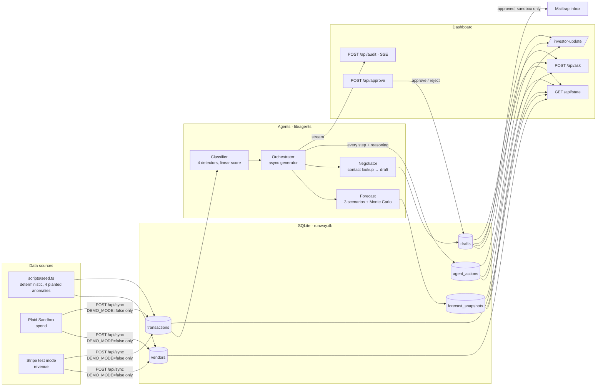

# Runway Radar — Architecture

One Next.js app, one SQLite file, no separate backend service. Agents run inside
API routes; the dashboard consumes them over Server-Sent Events. Everything below
runs on a laptop with no network, which is the whole point for a live demo.



## Request lifecycle: one click of "Run audit"

1. `POST /api/audit` opens an SSE stream and iterates `runAudit()` — an async
   generator in `lib/agents/orchestrator.ts`.
2. **Classifier** scans the latest billing period. Each detector is a small linear
   model; per-feature contributions are the exact Shapley values of that score
   (`w·(x − baseline)`), so the breakdown on every flag card is the decision, not a
   summary of it. Flags are written back onto the transaction rows.
3. **Forecast** projects 18 months of cash under *Current*, *Aggressive cut*, and
   *Hiring freeze*, plus a 4,000-trial Monte Carlo band per scenario. Snapshots persist.
4. **Negotiator**, per flag: resolves a billing contact with a three-tier resolver —
   Composio managed web search (with citations) → Tavily → the vendor record on file.
   This is the second real tool call in the chain, not a second prompt: the agent does
   research to find where the email should go, and the action log records which tier
   answered and the source it cited. A searched address is accepted only if it is on the
   vendor's own domain; anything else falls through. The resolver never throws.
   The Composio tier runs through the local `composio` CLI (managed auth, no env var)
   and its query is deliberately **not** `site:`-restricted — a site-restricted search
   summarises the vendor's billing docs and surfaces no address. Broad query plus the
   strict on-domain check is what works; don't "fix" it back. Then it
   drafts: the LLM writes the prose when available, otherwise a deterministic template.
5. **Orchestrator** compares each draft's estimated impact with `APPROVAL_THRESHOLD`
   ($1,000/mo). Under it: queued. Over it: held, `approval_required=1`. Every step is
   an `agent_actions` row with its reasoning text, streamed to the browser as it is
   written.
6. The `done` event carries the summary; the dashboard re-fetches `/api/state`.

In demo mode the Orchestrator paces events so the log visibly builds; the smoke test
sets pace to zero.

## The two modes

| | `DEMO_MODE=true` (default) | `DEMO_MODE=false` |
|---|---|---|
| Data | `npm run seed` — byte-identical every run | seeded **plus** `POST /api/sync` from Plaid sandbox / Stripe test |
| LLM | never called; templates | NVIDIA NIM, primary → backup → template |
| Contact lookup | vendor record | Composio web search → Tavily → vendor record |
| Email | drafts table only (Mailtrap if configured) | same |
| Q&A (`/api/ask`) | rule router only | rule router, LLM for open questions, grounded on a facts blob |
| Determinism | total | prose varies; flags and numbers do not |

Detection, forecasting, and the approval policy are identical in both modes. Only
prose generation and data ingestion change. That is what makes the "it's demo mode,
and the live path is the same code underneath" answer true.

## Safety boundaries (enforced in code, not in docs)

- `lib/mailer.ts` throws on any SMTP host that is not a Mailtrap sandbox.
- `lib/integrations/stripe.ts` throws on any key that is not `sk_test_`.
- `lib/integrations/plaid.ts` has `sandbox.plaid.com` hard-coded; no env var selects another.
- The contact resolver rejects any searched address not on the vendor's own domain —
  a lookup that returns an aggregator's address is worse than no lookup.
- `/api/approve` is the only path that marks a draft approved, and it requires a draft id
  and an explicit `"approve" | "reject"`.
- `scripts/preflight.ts` refuses to clear if `DEMO_MODE=false`, a live key, or a
  non-sandbox SMTP host is present.
- The threshold is a policy knob, not a safety proof. A real deployment would need
  rate limits, vendor allow-lists, and a human in the loop on *every* first contact.

## Explainability, honestly stated

No trained model, no SHAP library. Each detector is `sigmoid(bias + Σ wᵢ(xᵢ − bᵢ))`.
For a linear model, Shapley attribution reduces exactly to the per-term products, so
the breakdown is exact by construction. We chose this over a trained classifier
because (a) the demo must not depend on a model file, and (b) every weight is a
number a judge can read in `lib/agents/classifier.ts` and argue with.

## File map

```
lib/
  company.ts            constants, APPROVAL_THRESHOLD, DEMO_MODE
  types.ts              domain types; Flag, FeatureBreakdown
  db/                   better-sqlite3, schema.sql, typed queries, upserts
  agents/
    classifier.ts       four detectors + linear scorer
    forecast.ts         scenarios, Monte Carlo, savings estimates
    negotiator.ts       three-tier contact resolver (tool call) + draft
    orchestrator.ts     runAudit() async generator, approval policy
  llm.ts                NIM client with mandatory fallback
  mailer.ts             Mailtrap-only delivery
  integrations/
    plaid.ts            sandbox client
    stripe.ts           test-mode client with live-key guard
    sync.ts             maps both into vendors/transactions
  ask.ts                intent router + grounded LLM fallback
  investor-update.ts    slide payload from the audit
app/api/
  audit   state   approve   reset   sync   ask   investor-update
app/
  dashboard/            the product
  investor-update/      the closer
scripts/
  seed.ts               deterministic data with planted anomalies
  smoke-test.ts         52 checks over the agents
  smoke-integrations.ts 27 checks over sync, guards, ask, slide
  preflight.ts          T-10 gate: env + both suites + live routes
docs/
  DEMO_SCRIPT.md        what to say and click
  backup-demo.gif       recorded click path — the fallback if anything fails live
```
